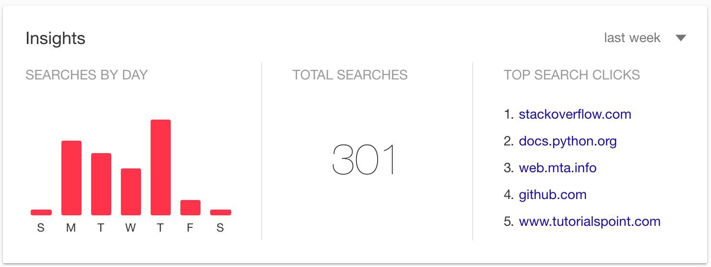
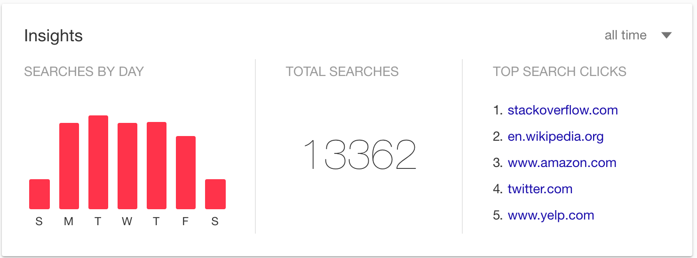
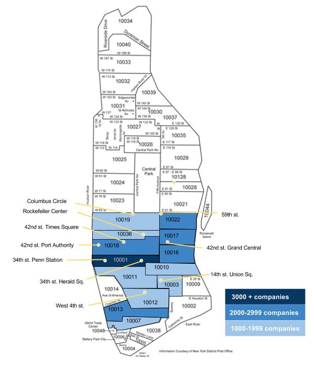

What would I do without Google? I would fail. Terribly. As far as I know Data Science did not exist before Google and I can understand why. There is an incredible amount of information to keep track of and being able to rely on Google for quick answers is invaluable. This is what the summary of my Google searches for last week looks like:

And this is the summary for my all time searches (or since the last time I deleted my history, I guess):

Stack Overflow has already risen to the top of the top clicks list. At career night for the last Metis cohort the representatives from Stack Overflow got a huge round of applause. If they are around in 10 weeks when it is my career night I may have to bring them chocolate and flowers. And my first born child. 

But Google hasn't only been useful in reminding me how to format my Python code and for a quick look-up about what the weird math symbol is supposed to represent, it was also essential in doing my share of our first project.

<b>Project Benson</b>

For our first Metis project we were split up into team of 4 and told to use MTA turnstile data to find the best subway stations to send street teams to in order to collect signatures (and raise awareness and funds) for a women in tech event. We were encouraged to find additional data sources to augment the MTA's dataset. 

While my team worked closely to define our task, assumptions, and approach - we decided to split up the work into sperate tasks. I focused on finding an appropriate data set (Thanks [US Census Bureau and American Fact Finder!](http://factfinder.census.gov/faces/nav/jsf/pages/download_center.xhtml)), wrangling that data, and trying to relate it back to the MTA analysis my teammates were working on. 

I knew my ideal data set would include the demographics of the people who live near a specific subway station or details on the people who work near a specific subway station. Google failed me and I was not able to find exactly what I wanted. So, I settled for [Community Business Pattern data](https://www.census.gov/econ/cbp/) broken down by ZIP code. I cleaned that data and created a table that tallied up tech related companies in each Manhattan ZIP code. Then I tried to teach myself how to build a choropleth map in Python. (A choropleth map is a map where areas are shaded in proportion to a variable. They look like [this.](http://revolution-computing.typepad.com/.a/6a010534b1db25970b0120a69561cb970b-popup)) I was not successful. (Hey! it's was my first week!) So instead I harnessed my former-art-teacher skills and I colored in a map:

Was it a perfect project? Absolutely not. But I did learn a huge amount and we did have relevant information to present just a few days after we were given our assignment. I'm excited to continue at this pace for the next 10 weeks (we are already 1/6 of the way through!). Hopefully I will learn how to make some pretty charts between now and then.

